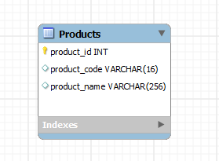
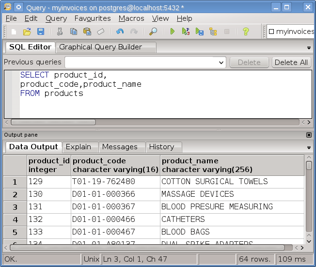
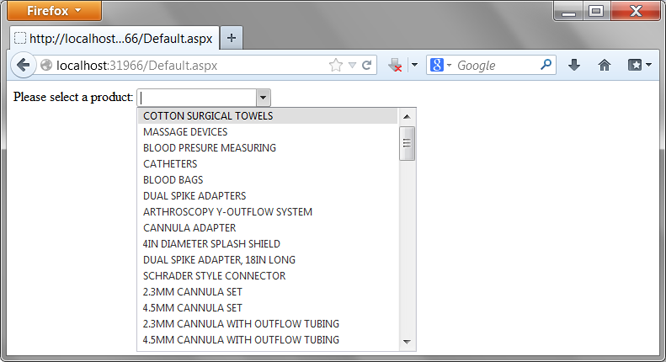
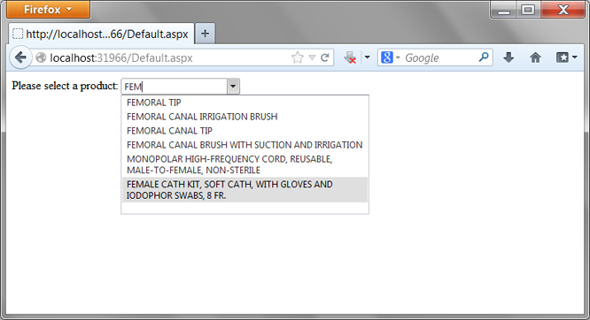
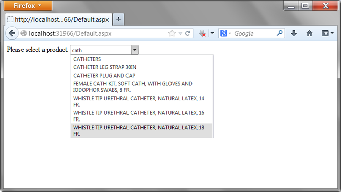
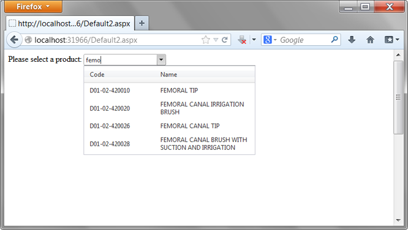

# Usando el control RadComboBox de Telerik con PostgreSQL

Aunque ASP.NET ofrece una extensa colección de Web Controls que proporcionan  al desarrollador una programación fácil, estandarizada y orientada a objetos, también existe como parte del ecosistema de ASP.NET la suite de controles <a href="http://www.telerik.com/products/aspnet-ajax.aspx">Telerik</a>  que complementan y ofrecen más funcionalidad que los Web Controls predeterminados incluidos en el conjunto estándar de ASP.NET.

Del conjunto de controles de la suite Telerik, mostraré brevemente el uso del control <a href="http://demos.telerik.com/aspnet-ajax/combobox/examples/overview/defaultcs.aspx">RadComboBox</a> de Telerik, el cual extiende la funcionalidad proporcionada por el control DropDownList de ASP.NET al tener no solamente las características de este control sino capacidades adicionales como:la carga de datos de diferentes colecciones de datos, API con funciones de servidor y de cliente, el uso de templates para mejorar la aparencia visual y la propiedad de cargar items bajo demanda para mejorar el rendimiento.

A continuación un sencillo ejemplo para mostrar dos características básicas de este control:
<ul>
<li>La carga de items bajo demanda (Load on Demand)</li>
<li>El uso de templates para la aparencia visual de los items.</li>
</ul>
El ejemplo consiste de una página ASP.NET que consulta una tabla de <b>products</b> que contiene una lista de productos clínicos de una base de datos <b>myinvoices</b>, la tabla tiene el siguiente esquema:

 

Consultamos la lista de productos

El ejemplo esta compuesto por 6 clases: <i>DataManager</i>, <i>Logger</i>, <i>PostgreSQLCommand</i>,<i>PostgreSQLDataBase</i>, <i>Product</i>, <i>ProductFilters</i> y dos páginas ASP.NET: <i>Default.aspx</i> y <i>Default2.aspx</i>.

<b>La Carga de items bajo demanda</b>
Una de las capacidades más utilizadas del control <i>RadComboBox</i> es la capacidad de cargar las opciones o items bajo demanda es decir construir la consulta en base a las coincidencias de los items y lo teclado por el usuario, esta capacidad se programa con el metódo <b>cmbProducts_OnItemsRequested </b>

<pre>
protected void cmbProducts_OnItemsRequested(object sender,
        RadComboBoxItemsRequestedEventArgs args) {
        DataManager dm = new DataManager();
        ProductFilters filter = new ProductFilters { 
            ProductName = args.Text
        };

        if (cmbProducts.DataSource == null)
        {
            cmbProducts.DataSource = dm.GetProducts(filter);
            cmbProducts.DataValueField = "Product_ID";
            cmbProducts.DataTextField = "ProductName";
            cmbProducts.DataBind();
        }
    }
</pre>

En este metódo se contruye una clase <i>ProductFilter</i> que contine el texto tecleado por el usuario en el <i>RadComboBox</i>, una vez creada esta clase se pasa como argumento al metódo <i>GetProducts</i> de la clase <i>DataManager</i> dentro de este metódo se construye la consulta SQL que filtra mediante un comando <b>LIKE</b> la consulta de la tabla <i>Products</i> hacia la lista <b>(List)</b> que sirve de <b>DataSource</b> para el <b>RadComboBox</b>.

<pre>
//Here we past the filter in order to build the SQL Query
public List<Product> GetProducts(ProductFilters filters) {
    StringBuilder commandText = new StringBuilder("SELECT product_id, ")
    .Append("product_code, ")
    .Append("product_name ")
    .Append("FROM Products ")
    .AppendFormat("WHERE product_name Like '%{0}%'",filters.ProductName.ToUpper());
    List<Product> productList = null;
    Product p = null;
    using(NpgsqlDataReader reader = PostgreSQLCommand.GetReader(commandText.ToString(),
        null,
        CommandType.Text)){
        productList = new List<Product>();
        while (reader.Read()) {
            p = new Product();
            p.Product_ID = Convert.ToInt32(reader["product_id"]);
            p.ProductCode = reader["product_code"].ToString();
            p.ProductName = reader["product_name"].ToString();
            productList.Add(p);
        } 
    }
    return productList;
}
</pre>

Al ejecutar la página vemos el resultado como en las siguientes imágenes:

 

Se realiza la búsqueda de las coincidencias entre lo tecleado por el usuario y el listado de productos

 

Es característica mejora el rendimiento de los formularios.

 

<b>Uso de  un template para los items.</b> 
Uno de los aspectos visuales más llamativos de este control Telerik es el utilizar un template para personalizar la aparencia de la lista de elementos seleccionables, como ejemplo en la siguiente página <i>Default2.aspx</i> utilizamos la misma funcionalidad de la página <i>Default.aspx</i> con la diferencia de utilizar una tabla como template para los items.

El código de la página ASP.NET <i>Default2.aspx</i> que muestra el uso de un template para los items.

Al ejecutar la página Default2.aspx, veremos el resultado como en la siguiente imágen:

